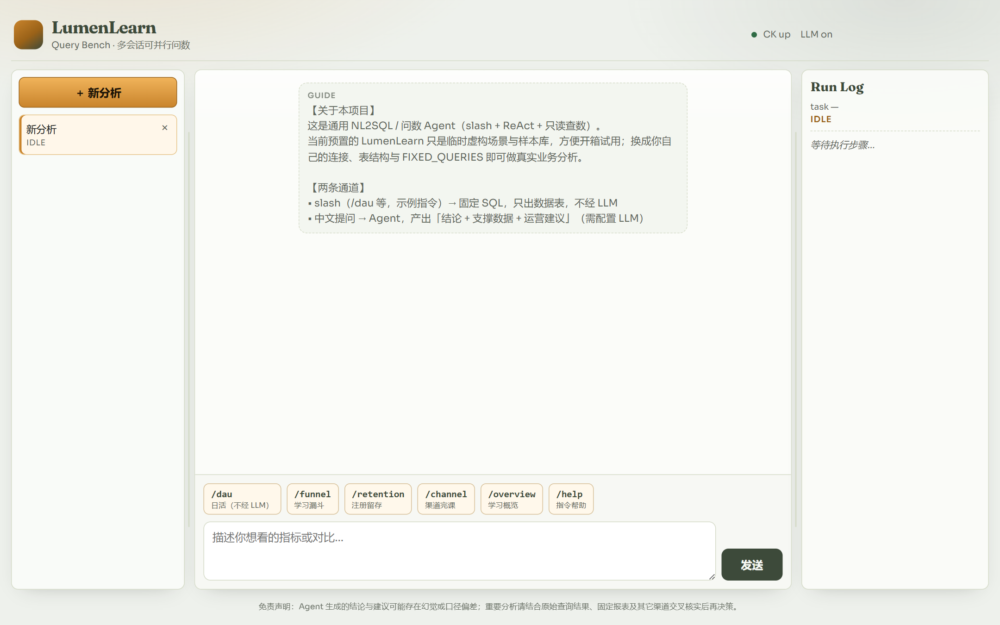
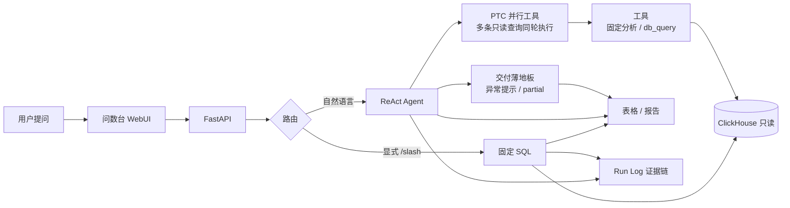
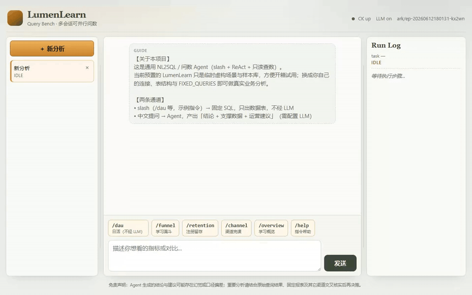
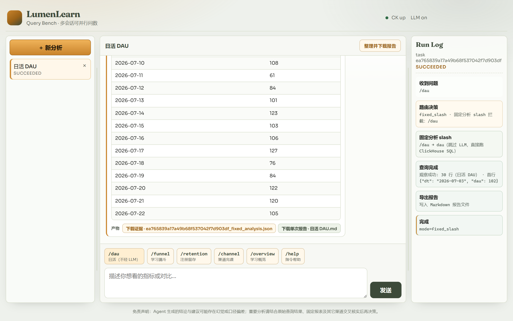
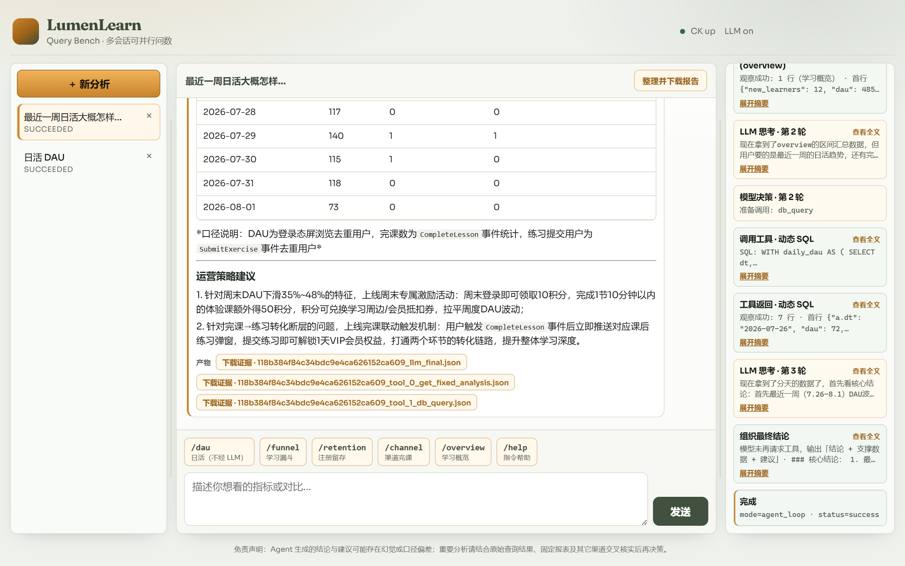
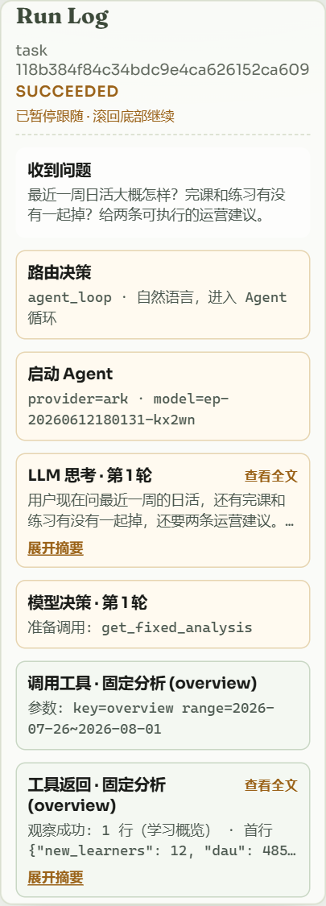
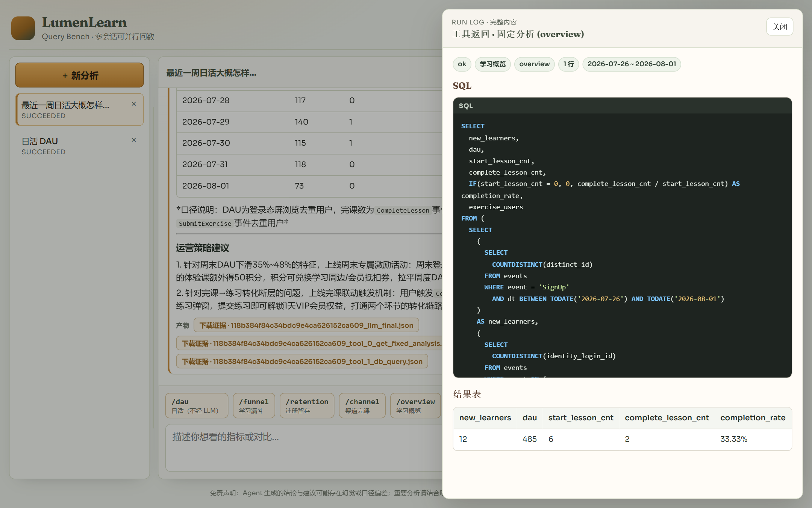

# nl2sql-agent

**NL2SQL / 问数 Agent** · 用自然语言问数，而不是写 SQL

[](LICENSE)
[](https://www.python.org/)
[](webui/)
[](https://clickhouse.com/)
[](#双通道交付)

slash 固定分析 + ReAct 工具循环（**PTC 并行工具调用**）→ 只读查 ClickHouse → 表格、结论，以及可回看的 Run Log / 证据链。

复杂或多需求提问时，Agent 可在同一步并行发起多条只读查询（如同时查 DAU、漏斗、渠道），总耗时接近最慢的那条，而不是各条串行相加，从而**显著加快**多指标对比与综合诊断。

本仓库是通用问数引擎（路由、Agent、只读防护、问数台）。**LumenLearn（流明学堂）** 只是附带的虚构演示场景与合成数据，方便 clone 后立刻跑通；换成自有库与 `FIXED_QUERIES` 即可接真实业务。

需要「埋点采集 → 入仓」链路时，可配合独立仓库 [lumenlearn-event-pipeline](https://github.com/Jehuty-ML/lumenlearn-event-pipeline)（Nginx → Flume → Kafka → Flink）；本 Agent **只读查 ClickHouse**，不依赖必须跑通采集集群。



<p align="center"><sub>左会话 · 中对话 · 右 Run Log · 底部 slash 快捷指令</sub></p>

### 试问示例（复制即用）

| 类型 | 直接粘贴 |
|------|----------|
| Slash 出表 | `/dau` · `/funnel` · `/retention` · `/channel` · `/overview` |
| 趋势解读 | `最近一周日活大概怎样？完课和练习有没有一起掉？给两条可执行的运营建议。` |
| 漏斗诊断 | `学习漏斗里哪一步掉得最狠？可能原因和下一步动作是什么？` |
| 渠道对比 | `各渠道完课率差多少？哪个值得加投放、哪个该先修内容？` |
| 多需求并行（PTC） | `同时看最近一周日活、学习漏斗掉点、各渠道完课率，并给两条运营建议。` |

> 无 LLM Key 时仍可点 slash；自然语言路径需配置 `.env` 中的 LLM。

---

## 30 秒看懂定位

| 你是… | 这个项目能帮你… |
|--------|------------------|
| 想接自有指标的数据/BI 团队 | 换连接、元数据与 `FIXED_QUERIES`，留下引擎与问数台 |
| 想演示 NL2SQL / Agent 问数 | clone 后起示例 ClickHouse，立刻点 `/dau` 或中文提问 |
| 要一次问多个指标、嫌串行太慢 | 自然语言走 **PTC**：同轮并行查数，复杂/多需求查询明显更快 |
| 关心安全与可审计 | 只读三道防线 + 异常交付提示 + Run Log / 证据落盘，数字可回追 |

```text
你的问题
   │
   ├─ /dau  /funnel  …     →  固定 SQL（不经 LLM）→ 数据表
   │
   └─ 「最近一周日活怎样？」 →  ReAct Agent（可 PTC 并行多查）→ 结论 + 表 + 建议
                                              ↑
                                    Run Log：思考 / 调工具 / 观察
```

### 架构（示意）



---

## 界面一览

<p align="center">
  
</p>

<p align="center"><sub>演示（约 20s 加速回放）：点 <code>/dau</code> 出表 → 中文提问 → 结论与 Run Log</sub></p>

### 1. Slash：一键看板报告（不经 LLM）

点 `/dau`、`/today_dashboard` 等快捷指令，走注册好的标准 SQL，并自动画图、写出 Markdown 报告；右侧 Run Log 会标明 `fixed_slash`。



<p align="center"><sub>示例：`/dau` → DAU 表 + 趋势图 + 报告产物（全程不调用 LLM）</sub></p>

### 2. 自然语言：结论 + 支撑数据 + 建议

中文提问进入 Agent；模型可调用固定分析 / 动态 SQL。一次问多个独立指标时走 **PTC**（同轮并行工具调用），缩短复杂/多需求查询的等待时间。界面顶栏可「整理并下载报告」；Agent 默认不自动导出报告。



<p align="center"><sub>示例：「最近一周日活…给两条运营建议」→ 表 + 建议；右侧可见工具调用与 SQL</sub></p>

### 3. Run Log：证据链可回看

思考、调工具、观察结果都在右侧时间线。步骤旁有 **查看全文**；点开后抽屉展示美化后的思考 / SQL / 结果表，便于核对数字从哪来。

<p align="center">
  
  &nbsp;
  
</p>

<p align="center"><sub>左：Run Log 时间线（含「查看全文」）· 右：点开后的全文抽屉（SQL + 结果表）</sub></p>

### 4. 报告与证据下载

| 入口 | 说明 |
|------|------|
| 消息底部 **产物** | 单次分析的证据 JSON、slash 写出的单次报告 MD，走 `/download/...` |
| 顶栏 **整理并下载报告** | 至少完成一轮分析后可用；打包 zip：`report.md` + `evidence/*.json` |

解压后用编辑器打开 `report.md`，其中的 `./evidence/...` 相对链接可直接点开原始证据。无证据时仅下载 Markdown。

---

## 能力摘要

### 双通道交付

| 输入 | 路径 | LLM | 交付形态 |
|------|------|-----|----------|
| `/dau` `/funnel` `/retention` `/overview` `/channel` `/help`（示例） | 固定 SQL | 否 | 标题 + 元信息 + **数据表**（并可落盘报告 / 证据） |
| 自然语言 | ReAct Agent + **PTC** | 是 | **结论** + 支撑数据 + **运营建议**；多指标同轮并行查数，复杂查询更快 |

只有显式 `/` 会在进 Agent 前硬拦截；句子里的业务词不会抢跑固定分析。快捷按钮发的是 slash，不是中文短句。

### PTC 并行工具调用

自然语言路径支持 **PTC（Parallel Tool Calls）**：模型在同一轮可同时发起多条只读工具（`get_fixed_analysis` / `db_query`），运行时并行执行，结果仍按调用顺序写回 Run Log 与上下文。

| 场景 | 效果 |
|------|------|
| 复杂诊断（漏斗 + 留存 + 渠道一起看） | 少一轮串行往返，总延迟接近最慢的那条查询 |
| 多需求对比（「同时看日活、完课、练习」） | 一次提问并行取数，再统一写结论与建议 |
| 有依赖的下钻（后一条要用前一条结果） | 仍分多轮；写盘类 `export_report` 为屏障，默认不自动导出 |

上限由环境变量 `MAX_PARALLEL_TOOL_CALLS` 控制（默认 `4`；设为 `1` 可强制串行对照）。

### Agent 工具

| 工具 | 作用 |
|------|------|
| `get_fixed_analysis` | 执行已注册的标准分析（可带日期窗；可与其他只读工具 PTC 并行） |
| `db_query` | 只读 SQL 下钻（`SELECT` / `WITH`；工具层 + 库侧只读双重拦截；可 PTC 并行） |
| `export_report` | 仅当用户明确要求导出时调用；日常请用顶栏「整理并下载报告」 |

问数台还可把**整段会话**整理为 Markdown，并与 `.scratchpad/evidence/` 下原始证据一并打成 zip（见上文「报告与证据下载」）。

### 只读安全（三道防线）

| 层 | 做法 |
|----|------|
| **模型层** | Prompt + 工具 schema：仅 `SELECT` / `WITH … SELECT` |
| **工具层** | `sql_guard`：白名单、禁多语句、禁写/DDL；缺省补 `LIMIT` |
| **数据仓库** | 只读账号 + `GRANT SELECT`；会话 `settings.readonly=1` |

### 数据全链路可靠性

问数结果要「敢看、敢追」：查数异常时**明确提醒**，正常路径则能从结论**回溯到 SQL 与原始返回**。

#### 1. 异常提醒（交付薄地板）

自然语言 Agent 交卷前，会检查本轮是否真正跑通查数工具（`get_fixed_analysis` / `db_query`）：

| 情况 | 行为 |
|------|------|
| 没有任何成功的查数结果 | 回复顶部黄标 **【系统提示】**，状态标为 `partial`；**保留模型原文**，不打回重写 |
| 查数成功但 0 行 / 无可用行 | 同样提示「空结果请结合口径判断」，并以 Run Log / 工具返回为准 |
| 查数成功且有行 | 正常交付；表格优先来自工具结果，而非散文里手写数字 |

设计取舍：**薄地板、不硬栏**——不替用户「挡死」交付，但绝不假装「有数」。Slash 固定分析本身不经 LLM，数字路径更干净。

#### 2. 全链路可溯源

| 环节 | 你能看到什么 | 界面哪里 |
|------|----------------|----------|
| **路由** | `fixed_slash` / `agent_loop` | 右侧 **Run Log** 靠前步骤「路由决策」 |
| **思考** | 「LLM 思考」全文（含 reasoning，若有） | Run Log 对应步骤点 **查看全文** → 抽屉 |
| **调工具** | 固定分析 key / 动态 SQL | Run Log「调用工具 · …」；有 SQL 时可点 **查看全文** |
| **观察** | 元信息 + SQL 高亮 + 结果表 | Run Log「工具返回」→ **查看全文**（下图右） |
| **落盘** | `evidence/*.json`、任务进度 JSON | 服务端目录 `.scratchpad/`（不在 UI 里直接浏览） |
| **下载** | 单文件证据 / 会话报告 zip | 对话气泡底部 **产物**；顶栏 **整理并下载报告**（下图左中） |

<p align="center">
  
</p>

<p align="center"><sub>中栏下方「下载证据」= 产物入口；右侧 Run Log 步骤旁「查看全文」= 思考 / SQL / 工具返回入口。</sub></p>

<p align="center">
  
</p>

<p align="center"><sub>点 Run Log「工具返回 · …」的「查看全文」后：抽屉内为结构化 SQL + 结果表，而不是整墙 raw JSON。</sub></p>

一条推荐核对路径：

```text
结论里的数字 / 建议
  → 中栏表格（工具 rows）与气泡底部「下载证据」
  → 右侧 Run Log「工具返回」→ 查看全文
  → evidence/*.json 对照原始 SQL 与行数据
```
### 示例固定分析（演示用）

| 指令 | 指标（示例） |
|------|----------------|
| `/overview` | 区间新增、DAU、完课率、练习用户 |
| `/dau` | 按日 DAU |
| `/retention` | 注册 cohort D1 / D7 留存 |
| `/funnel` | 学习漏斗 |
| `/channel` | 渠道完课对比 |
| `/help` | 指令说明 |

换业务域时，改写 `FIXED_QUERIES` 与 slash 映射即可。

---

## 示例场景（LumenLearn）

为方便演示，仓库内置虚构学习社区 **LumenLearn** 的合成数据与 `/dau` 等 slash 指标。样本：Synthetic · No PII · 可复现 seed；业务日约 **2026-05-04 ~ 2026-08-01**。

| | 说明 |
|--|------|
| **本仓库** | NL2SQL 问数：路由 / ReAct + PTC 并行查数 / 只读防护 / 问数台 |
| **演示数据** | `infra/` ClickHouse、`scripts/generate_demo_data.py`、示例 slash |
| **可选采集** | [lumenlearn-event-pipeline](https://github.com/Jehuty-ML/lumenlearn-event-pipeline)（事件契约与本仓示例对齐） |

---

## 技术栈

| 层 | 选型 |
|----|------|
| API | FastAPI · 任务进度落盘 |
| Agent | 单 Agent ReAct · **PTC 并行工具调用** · OpenAI 兼容 Chat Completions |
| 数据 | ClickHouse（演示库见 `infra/`） |
| 前端 | Vue 3 + Vite |

---

## 快速开始（用演示数据跑通）

### 1. 依赖与配置

```powershell
cd nl2sql-agent   # clone 后的目录名
python -m venv .venv
.\.venv\Scripts\Activate.ps1
pip install -r requirements.txt
copy .env.example .env
```

### 2. 启动示例 ClickHouse 并灌数

需 Docker。

```powershell
docker compose -f infra/docker-compose.yml up -d
python .\scripts\generate_demo_data.py --seed 42 --to-clickhouse --truncate
```

详见 [`scripts/README.md`](scripts/README.md)。

### 3. 启动后端

```powershell
uvicorn app.server.app:app --host 0.0.0.0 --port 6010 --reload
```

打开：<http://127.0.0.1:6010/>

### 4. 前端（可选开发模式）

```powershell
cd webui
npm install
npm run build
# 或 npm run dev → http://127.0.0.1:5173
```

### 5. 冒烟

```powershell
python scripts\smoke_offline.py
python scripts\smoke_basic.py
```

### 接到你自己的库

1. 改 `.env` 的 `CH_*`（建议只读账号）
2. 更新 `app/bi/` 事件/指标与 `FIXED_QUERIES`、slash 路由
3. 调整 Agent Prompt 中的表字段说明
4. （可选）去掉或停用 `infra/` 示例 Compose 与造数脚本

---

## 配置

见 `.env.example`。

| 项 | 说明 |
|----|------|
| `CH_*` | ClickHouse；示例默认为 `lumenlearn` + `lumen_ro` |
| `LLM_PROVIDER` | `dashscope` / `deepseek` / `ark` / `ollama` / `openai` |
| `LLM_API_*` | 可选总覆盖 |
| `MAX_PARALLEL_TOOL_CALLS` | PTC 同轮并行工具上限（默认 `4`；设为 `1` 强制串行） |

无 API Key 时 slash 仍可用；自然语言需配置 LLM。

---

## API

| 方法 | 路径 | 说明 |
|------|------|------|
| `GET` | `/health` | 健康检查 |
| `POST` | `/api/v1/chat` | 对话（`sync` 可同步/异步） |
| `GET` | `/api/v1/task/{task_id}` | 任务进度 |
| `GET` | `/download/{path}` | 下载 `.scratchpad/` 内文件（证据 / 单次报告等；禁止目录穿越） |
| `POST` | `/api/v1/reports/bundle` | 会话报告打包：`report.md` + `evidence/*.json`（MD 内相对链接可跳转） |

---

## 目录速览

```
docs/screenshots/      # README 界面截图
infra/                 # 演示用 ClickHouse（可替换/删除）
app/bi/                # 指标与固定 SQL（按业务替换）
app/core/agent/        # ReAct · delivery_floor（异常提示）
app/core/routing/      # slash
app/core/tools/        # sql_guard / db_query / …
app/core/session/      # 任务进度落盘（Run Log 数据源）
.scratchpad/           # 运行时：tasks / evidence / reports（本地，默认不入库）
webui/                 # 问数台
scripts/               # 演示造数与冒烟
```

示例事件契约：`app/bi/events_dictionary.json`（与 [lumenlearn-event-pipeline](https://github.com/Jehuty-ML/lumenlearn-event-pipeline) 对齐）。

---

## 免责声明

Agent（尤其自然语言路径）生成的结论、解读与运营建议**可能存在幻觉、口径偏差或过度外推**。本项目用异常提示与证据链降低「空口无凭」的风险，但**不替代**人对数字与业务口径的核对。请以工具返回、Run Log 与固定分析报表为准；重要决策前务必多渠道核实，勿仅依赖模型叙述自动执行。

## 协议

MIT。
