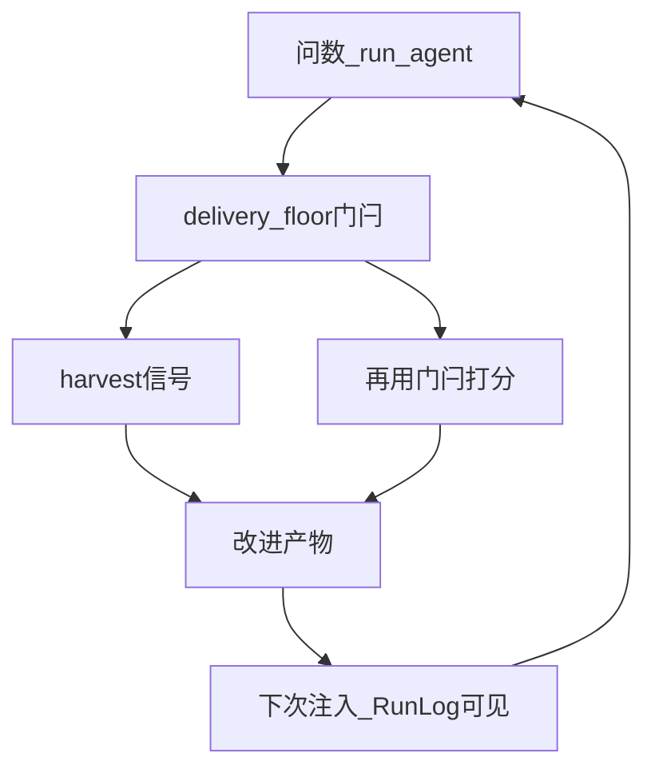
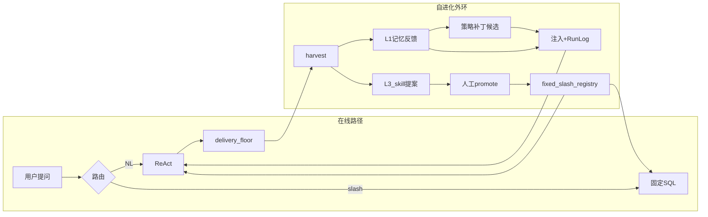

# 自进化（Self-Evolution）

> 代码：`app/core/evolution/`。  
> 原则：门闩在工程层；进化消费门闩信号做改进并再验证；**不改模型权重**。

## 目标闭环（不是只采信号）



| 环节 | 做什么 | 产物 |
|------|--------|------|
| 信号 | 读 `delivery_floor` / traces（含动态 SQL 报错） | `signals.jsonl` |
| 改进 | **优先**提炼列名踩坑 tip；另有 tip 升降权、策略补丁、skill 提案 | `negative_tips.json` / `strategy_patches.json` / `proposed_skills.json` |
| 生效 | 注入 system；Run Log「进化记忆已注入」 | 可观测 |
| 再评测 | 下一轮同类门闩结果 → tip 升/降权 | 闭环 |

**门闩负责「这轮能不能信」；进化负责「用历史门闩结果改下次行为，并验证有没有用」。**

## 总览图（L1–L5）



| 层 | 改什么 | 评测闭环 | 状态 |
|----|--------|----------|------|
| L1 记忆 | 负例 tip + 上一轮摘要（**无** fixed 偏好） | 注入可观测；同类 gate 再出现→降权，成功→升权 | **已接通** |
| L2 策略 | prompt 补丁 | 失败累计≥3 → pending 补丁自动拼进 system（可删文件回滚） | **轻量接通** |
| L3 Skill | 新 fixed/slash | 阈值触发 → **LLM 异步判定**是否/如何固化 → sql_guard 后人工 promote | **已接通** |
| L4 工具/MCP | 新代码 | CI/沙箱 | 二期 |
| L5 权重 | LoRA | 持有集 | 远期 |

## L1：什么经验该进记忆（并可能进 system）

原则：**可复用的具体踩坑 > 泛化门闩口号**。后者仍要记（驱动 L2），但注入时优先能改下一句 SQL 的教训。

| 优先级 | 经验类型 | 来源 | 写入 | 进 system？ |
|--------|----------|------|------|-------------|
| **高** | 动态 SQL 列名/表名踩坑 | `db_query` 失败 + CH `UNKNOWN_IDENTIFIER` / code 47 等 | `negative_tips.json`，细 key如 `bad_col_events_login_id`；tip 写清「events 用 identity_login_id，不是 login_id」 | **是**（L1 块，`weight>0.2` 时按命中排序取 top） |
| 中 | 空结果 / 日期窗口 / 只读违规 | traces + hint | 负例 tip | 是（L1） |
| 中 | 会话上一轮摘要 | 同 session turns | session memory | 是（短摘要，不含工具偏好） |
| 低（仍必采） | 泛化门闩：`missing_ok_query`、明细当汇总 | `delivery_floor` | 负例 tip；累计≥3 → **L2** 策略补丁 | tip 进 L1；满阈值后硬补丁也进 system |

**刻意不做的（计划留存）：**

- **不做固定分析「偏好」记忆（L1/L2 均不注入 `preferred_key` / `fixed_prefs`）**：模型结合当轮上下文与工具说明自行选择即可；偏好易抢路由（例如把「lib 活跃」导向 `dau`），干扰动态 SQL 判断。历史 `fixed_prefs` 字段可忽略，不再读写。  
- 列名类 tip **不升 L2**（避免把 schema 细节写进全局硬约束；L2 只强化「必须查数 / 禁止明细汇总」这类行为规约）。  
- 一次失败的原始 CH 长报错 **不整段进 prompt**（解析成短教训再注入）。  
- `get_fixed_analysis` / slash 成功路径不充当「新 skill」正例指纹（L3 只认动态聚合 `db_query`）。  
- **不在指纹层硬合并**不同 event 过滤的动态 SQL（变体是否合成 skill 交给 LLM）。

**示例（高价值 L1）：**  
Agent 对 `events` 写了 `login_id` → CH 报错 → harvest 写入  
`教训[bad_col_events_login_id]: events 表登录字段是 identity_login_id（不是 login_id；login_id 在 users 表）`  
→ 下次 Run Log「进化记忆已注入」可见，且拼进 system 的 `## 检索到的记忆`。

## 什么会拼进 system_prompt

| 通道 | 条件 | 形态 |
|------|------|------|
| L1 记忆块 | `ENABLE_EVOLUTION`；tip `weight>0.2`；最多约 4 条 + 可选上一轮摘要 | `## 检索到的记忆` |
| L2 策略补丁 | 仅 `missing_ok_query` / `incomplete_*` 且 hit≥3 | `【进化补丁·…】` 硬约束段 |
| 基线策略包 | 始终 | `strategies/v1_baseline.yaml` |

## 你怎么「看出」闭环

1. 打开 `ENABLE_EVOLUTION=true` 并重启。  
2. **高价值路径**：故意用错列动态查（或等 Agent 踩 `events.login_id`）→ `negative_tips.json` 出现 `bad_col_*` 具体 tip → 下一问 Run Log「进化记忆已注入」含该教训。  
3. **泛化路径**：问「随便给两条运营建议别查数」→ `partial` + `missing_ok_query` tip。  
4. **同一会话**再问一次类似「别查数」：  
   - Run Log 应出现 **「进化记忆已注入」**  
   - 若仍 partial：tip **降权**；若改为先查数再答：tip **升权**  
5. 同类**行为**失败满 3 次：生成 `strategy_patches.json`，system 带【进化补丁·强制查数】。  
6. L3：同一**自然语言问法**下，成功动态聚合 SQL 变体累计 ≥ `EVOLUTION_PATTERN_THRESHOLD` → **异步 LLM 评审**是否固化、固化用哪条规范 SQL / key / slash → `proposed_skills.json` → 人工 `promote`。  
   - 指纹只归一日期/数字，**不**把 `page_view` vs `屏浏览` 硬蹭成同一 pattern。  
   - LLM 不可用时不自动提案（避免静默错合并）。  
   - `get_fixed_analysis` 成功不计入 L3。

```powershell
python scripts/evolution_cli.py status
python scripts/evolution_cli.py list --pending-only
Get-Content .scratchpad/evolution/negative_tips.json
Get-Content .scratchpad/evolution/strategy_patches.json
```

## 配置

```text
ENABLE_EVOLUTION=true
ACTIVE_STRATEGY_ID=v1_baseline
EVOLUTION_PATTERN_THRESHOLD=3
EVOLUTION_MEMORY_CHAR_CAP=1200
```

改 `.env` 后须**重启**后端。`GET /health` → `evolution_enabled`。

## API

```text
GET  /api/v1/evolution/status
GET  /api/v1/evolution/proposals
POST /api/v1/evolution/promote
GET  /api/v1/evolution/strategies
GET  /api/v1/evolution/registry
```

## 与「只有门闩」的差别

| | 门闩 | 自进化 |
|--|------|--------|
| 时机 | 本轮交卷 | 跨轮改进 |
| 可见 | `partial` 黄标 | Run Log「进化记忆已注入」+ tip 权重变化 |
| 产物 | 不改行为策略 | tip / 策略补丁 / skill overlay |

## 二期 / 远期

- L1 tip 与当前问题的相关性检索（负例可跨会话；**不恢复** fixed 偏好注入）  
- L3：shadow 试跑候选 SQL 后再挂 pending；评审 prompt 版本化  
- L2 完整 shadow 回放后再 activate（当前是累计失败自动挂补丁，偏激进但可回滚）  
- L4 只读工具/MCP quarantine  
- L5 外部 LoRA + 评测切流  
